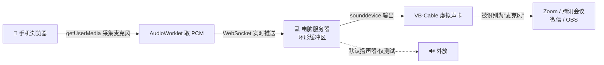

# 🎙️ Phone-as-Mic

> 把手机变成电脑的麦克风 —— 手机浏览器采集麦克风，经 WebSocket 实时推送，电脑端通过 VB-Cable 虚拟声卡输出，让 Zoom / 腾讯会议 / 微信 / OBS 等任意软件把手机当成麦克风使用。

[](https://github.com/hb250625-dotcom/phone-as-mic/releases)
[](https://github.com/hb250625-dotcom/phone-as-mic/releases)
[](https://github.com/hb250625-dotcom/phone-as-mic)
[](LICENSE)
[](https://www.python.org/)

**无需在手机安装 App** —— 手机端就是一个网页，浏览器即可完成麦克风采集与推送。电脑端已打包成独立 `exe`，**双击即用，零安装**。

---

## ✨ 特性

- 📱 **手机即麦克风** —— 把闲置手机变成高清麦克风，告别劣质内置麦
- 🌐 **纯网页方案** —— 手机端无需安装任何 App，扫码即用
- 🔌 **三种连接方式** —— WiFi / USB 网络共享 / ADB 直连，按需选择
- 🔒 **默认 HTTPS** —— 自签名证书自动生成，局域网下浏览器才允许用麦克风
- 📦 **独立可执行文件** —— 全部依赖已打包进 `phone_mic.exe`，无需 Python 环境
- 🎧 **实时低延迟** —— 48kHz PCM 直传，未做压缩，普通 WiFi 无压力
- 🖥️ **电脑控制面板** —— 可选音频设备、查看实时电平与连接状态

---

## 🏗️ 工作原理



---

## 🚀 快速开始（三步）

> 已打包成独立 exe，不用装 Python、不用敲命令。

1. **双击 `启动.bat`**（或直接双击 `phone_mic.exe`）→ 自动打开电脑面板并弹出二维码。
2. **手机扫码**（或浏览器打开 `https://电脑IP:8080/phone`）→ 点「🎤」授权麦克风。
   - 首次打开会提示「证书风险」，点「高级 → 继续访问」即可（自签名证书，仅本机使用）。
3. 想让会议 / 微信 / OBS 用上它：电脑装一次免费的 **VB-Cable**，把麦克风选成 **CABLE Output**。

搞定。其余章节为原理与进阶说明。

---

## 📋 环境要求

| 组件 | 说明 |
|---|---|
| Windows 电脑 | 运行 `phone_mic.exe`（已内置全部依赖） |
| 安卓 / iOS 手机 | 任意现代浏览器（Chrome / Safari 等） |
| VB-Cable（可选但推荐） | 免费虚拟声卡，让其它软件把手机当麦克风。不装也能用，但只能外放测试。<br/>下载：https://vb-audio.com/Cable/ |

---

## 🔧 命令行参数

双击 `启动.bat` 即可，无需参数。如需自定义，可在命令行运行 `phone_mic.exe` 并附加：

```bash
phone_mic.exe                 # 默认：HTTPS + 自动打开面板 + 端口 8080
phone_mic.exe --no-https      # 关闭 HTTPS（仅建议配合 ADB 的 localhost 使用）
phone_mic.exe --device CABLE  # 指定输出到 VB-Cable（按名称匹配或设备索引）
phone_mic.exe --port 9000 --sample-rate 48000   # 自定义端口 / 采样率
```

| 参数 | 默认值 | 说明 |
|---|---|---|
| `--port` | `8080` | 监听端口 |
| `--device` | 自动检测 | 音频输出设备名或索引 |
| `--sample-rate` | `48000` | 采样率 |
| `--https` | 开 | 启用 HTTPS 自签名证书 |
| `--no-https` | — | 关闭 HTTPS（配合 ADB localhost 使用） |

---

## 🔌 三种连接方式

### 方式一 · WiFi / USB 网络共享（最常用，默认 HTTPS）
程序默认已启用 HTTPS，手机通过局域网 IP 访问即可（浏览器规定非 `localhost` 必须有 HTTPS）：

- 手机与电脑连同一 WiFi，或手机开启「USB 网络共享」后 USB 连电脑。
- 手机浏览器打开电脑面板里二维码对应的 `https://电脑IP:8080/phone`（也可直接扫码）。
- 首次访问会提示证书风险，点「高级 → 继续访问」即可。

### 方式二 · ADB 直连（手机端无证书提示，最低延迟）
1. 手机开启「开发者选项 → USB 调试」，电脑装好 [ADB](https://developer.android.com/tools/releases/platform-tools)。
2. 用 `--no-https` 启动，并做端口转发：
   ```bash
   phone_mic.exe --no-https
   adb forward tcp:8080 tcp:8080
   ```
3. 手机浏览器打开 `http://localhost:8080/phone`，点「🎤」授权即可。
   > `localhost` 是安全上下文，HTTP 也能用麦克风，手机端无证书提示。

### 方式三 · Chrome 不安全来源白名单（仅 WiFi 且不想用 HTTPS 时）
打开 `chrome://flags/#unsafely-treat-insecure-origin-as-secure`，把 `http://电脑IP:8080` 加进去并重启浏览器。

---

## 🎯 把手机设为电脑的“麦克风”

1. 电脑打开控制面板（启动后自动弹出）。
2. 在「音频输出设备」中选择 **VB-Cable / CABLE Output**（检测到会自动预选）。
3. 打开 Zoom / 腾讯会议 / 微信 / OBS → 麦克风选择 **CABLE Output (VB-Audio Virtual Cable)**。
4. 手机端点「🎤」开始说话，对方 / 软件即可听到手机麦克风的声音。
5. 想自己监听可在手机页开启「监听（戴耳机）」开关 —— **务必戴耳机**，否则会啸叫。

---

## ❓ 常见问题

**Q：手机点按钮提示“无法访问麦克风”？**
- 多为安全上下文限制。用 ADB 的 `localhost` 或默认 HTTPS 启动；并检查手机浏览器是否已授予麦克风权限。

**Q：控制面板找不到 VB-Cable？**
- 确认已安装并重启电脑；在「声音设置 → 录制」里应能看到 `CABLE Output`。没装时先用默认扬声器测试，能听到声音即说明链路已通。

**Q：有延迟 / 卡顿？**
- 走 USB（ADB 或 USB 共享）延迟最低最稳；WiFi 下尽量靠近路由器、避开 2.4G 拥堵。
- 本工具使用 48kHz PCM 直传，未压缩，码率约 1.5 Mbps，普通 WiFi 无压力。

**Q：想把音频存成文件？**
- 当前版本主打“虚拟麦克风”实时通路。如需录音，可用 OBS / Audacity 选择 CABLE Output 录制；本地保存功能将在后续版本加入。

---

## 🧩 技术栈

- **后端**：Python · [aiohttp](https://docs.aiohttp.org/)（HTTP + WebSocket）· [sounddevice](https://python-sounddevice.readthedocs.io/)（音频输出）· [numpy](https://numpy.org/)
- **前端**：原生 HTML / JS · Web Audio API（getUserMedia · AudioWorklet）· 移动端深色主题
- **传输**：WebSocket 二进制帧，48kHz / 16bit PCM 直传
- **打包**：[PyInstaller](https://pyinstaller.org/) 单文件 exe

---

## 📁 仓库结构

| 文件 | 说明 |
|---|---|
| `phone_mic.exe` | 已打包的独立程序（双击即用，已含全部依赖与手机网页） |
| `启动.bat` | 一键启动器，直接运行 `phone_mic.exe` |
| `LICENSE` | MIT 开源协议 |
| `~/.phone-as-mic/cert.pem` | 首次启动自动生成的 HTTPS 证书（用户目录，自动创建） |

---

## 📄 开源协议

本项目基于 [MIT License](LICENSE) 开源。
